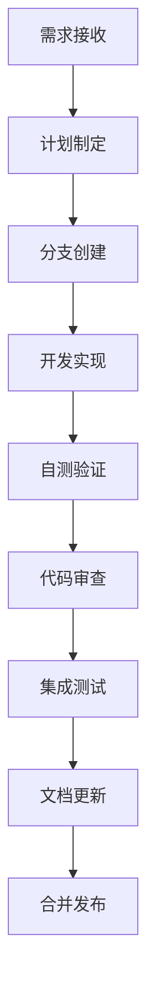
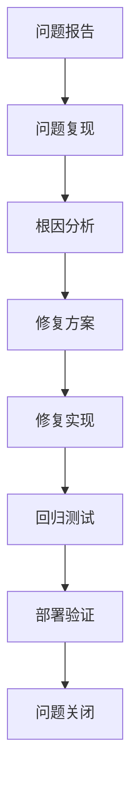
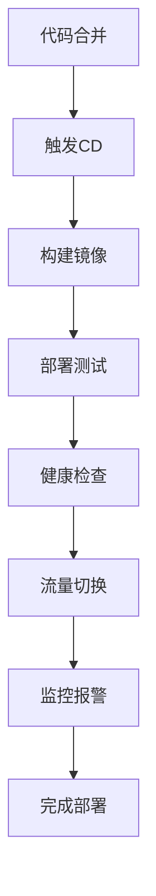

# DevContinuum 开发工作流程

## 🎯 工作流概述

DevContinuum 采用标准化的开发工作流程，确保代码质量、团队协作和项目可维护性。所有工作流都通过 DevContinuum Skill 进行自动化支持和优化。

## 🔄 核心工作流

### 1. Feat 工作流 - 新功能开发

#### 适用场景
- 添加新功能模块
- 实现用户故事
- 技术债务重构
- 性能优化改进

#### 工作流步骤



#### 详细步骤

**1. 需求接收**
- 从产品负责人接收功能需求
- 明确功能范围和验收标准
- 评估技术可行性和工作量

**2. 计划制定**
- 使用 DevContinuum Skill 生成开发计划
- 拆解任务为可执行的子任务
- 识别风险和依赖关系
- 制定时间估算和里程碑

**3. 分支创建**
```bash
git checkout develop
git pull origin develop
git checkout -b feature/功能名称
```

**4. 开发实现**
- 遵循项目代码规范
- 实现核心功能逻辑
- 编写单元测试
- 实时更新进度文档

**5. 自测验证**
- 运行单元测试: `npm run test`
- 运行代码检查: `npm run lint`
- 手动测试核心功能
- 验证代码覆盖率

**6. 代码审查**
- 创建 Pull Request
- 邀请团队成员审查
- 根据反馈进行修改
- 确保所有检查通过

**7. 集成测试**
- 运行完整测试套件
- 验证与其他模块的集成
- 性能测试和负载测试
- 安全扫描和漏洞检查

**8. 文档更新**
- 更新用户文档
- 更新API文档
- 更新技术文档
- 更新变更日志

**9. 合并发布**
```bash
git checkout develop
git merge --no-ff feature/功能名称
git push origin develop
```

### 2. Fix 工作流 - Bug修复

#### 适用场景
- 生产环境Bug修复
- 测试环境Bug修复
- 安全漏洞修复
- 性能问题修复

#### 工作流步骤



#### 详细步骤

**1. 问题报告**
- 接收Bug报告（Issue/用户反馈）
- 记录问题详细信息
- 评估问题严重程度
- 确定优先级

**2. 问题复现**
- 根据报告信息复现问题
- 记录复现步骤和环境
- 收集相关日志和截图
- 确认问题影响范围

**3. 根因分析**
- 分析问题根本原因
- 使用调试工具定位问题
- 评估修复难度和影响
- 制定修复策略

**4. 修复方案**
- 设计修复方案
- 评估方案风险
- 准备回滚计划
- 制定测试策略

**5. 修复实现**
```bash
git checkout -b bugfix/问题描述
git commit -m "fix(问题模块): 修复[具体问题]"
```

**6. 回归测试**
- 验证修复效果
- 运行相关测试用例
- 检查是否有副作用
- 更新测试用例

**7. 部署验证**
- 部署到测试环境
- 验证修复效果
- 监控系统状态
- 收集用户反馈

**8. 问题关闭**
- 关闭相关Issue
- 更新问题状态
- 记录修复经验
- 分享修复方案

### 3. CI 工作流 - 持续集成

#### 适用场景
- 代码提交验证
- 自动化测试执行
- 构建和打包
- 质量门禁检查

#### 工作流步骤


#### GitHub Actions 配置

```yaml
name: CI Pipeline

on:
  push:
    branches: [ develop, main ]
  pull_request:
    branches: [ develop, main ]

jobs:
  lint:
    runs-on: ubuntu-latest
    steps:
      - uses: actions/checkout@v3
      - uses: actions/setup-node@v3
        with:
          node-version: '18'
      - run: npm ci
      - run: npm run lint

  test:
    runs-on: ubuntu-latest
    steps:
      - uses: actions/checkout@v3
      - uses: actions/setup-node@v3
        with:
          node-version: '18'
      - run: npm ci
      - run: npm run test:cover
      - uses: codecov/codecov-action@v3

  build:
    runs-on: ubuntu-latest
    steps:
      - uses: actions/checkout@v3
      - uses: actions/setup-node@v3
        with:
          node-version: '18'
      - run: npm ci
      - run: npm run build
      - uses: actions/upload-artifact@v3
        with:
          name: build-artifacts
          path: dist/

  security:
    runs-on: ubuntu-latest
    steps:
      - uses: actions/checkout@v3
      - uses: actions/setup-node@v3
        with:
          node-version: '18'
      - run: npm ci
      - run: npm audit
      - run: npm run security-scan
```

### 4. CD 工作流 - 持续部署

#### 适用场景
- 自动化部署
- 环境配置管理
- 版本发布管理
- 回滚机制

#### 工作流步骤



#### 部署策略

**蓝绿部署**
- 同时运行两个生产环境
- 逐步切换流量
- 快速回滚能力
- 零停机部署

**金丝雀发布**
- 小流量验证
- 逐步扩大范围
- 实时监控反馈
- 自动回滚机制

## 📋 代码审查流程

### 审查清单

#### 代码质量
- [ ] 代码符合项目规范
- [ ] 命名清晰有意义
- [ ] 函数职责单一
- [ ] 无重复代码
- [ ] 适当的注释

#### 功能正确性
- [ ] 功能实现符合需求
- [ ] 边界条件处理
- [ ] 错误处理完善
- [ ] 无内存泄漏
- [ ] 性能考虑充分

#### 测试覆盖
- [ ] 单元测试覆盖关键逻辑
- [ ] 测试用例设计合理
- [ ] 测试数据准备充分
- [ ] 测试断言明确
- [ ] 测试可维护性

#### 安全性
- [ ] 输入验证和过滤
- [ ] 无敏感信息泄露
- [ ] 权限控制正确
- [ ] SQL注入防护
- [ ] XSS防护

### 审查工具

```yaml
# .github/workflows/code-review.yml
name: Code Review

on:
  pull_request:
    types: [opened, synchronize, reopened]

jobs:
  review:
    runs-on: ubuntu-latest
    steps:
      - uses: actions/checkout@v3
      
      # 代码检查
      - name: ESLint
        run: npm run lint
      
      # 类型检查
      - name: TypeScript
        run: npm run type-check
      
      # 测试覆盖率
      - name: Test Coverage
        run: npm run test:cover
      
      # 安全扫描
      - name: Security Scan
        run: npm run security-scan
      
      # 代码复杂度分析
      - name: Code Complexity
        run: npm run complexity-check
```

## 🔄 分支管理策略

### 分支类型

| 分支类型 | 用途 | 生命周期 | 合并目标 |
|----------|------|----------|----------|
| `main` | 生产环境 | 永久 | -
| `develop` | 开发集成 | 永久 | `main`
| `feature/*` | 功能开发 | 临时 | `develop`
| `bugfix/*` | Bug修复 | 临时 | `develop`
| `hotfix/*` | 紧急修复 | 临时 | `main`, `develop`
| `release/*` | 版本发布 | 临时 | `main`, `develop`

### 分支命名规范

```
feature/user-authentication     # 功能分支
bugfix/login-validation        # Bug修复分支
hotfix/security-vulnerability  # 紧急修复分支
release/v1.2.0                 # 发布分支
docs/api-documentation         # 文档分支
test/performance-testing       # 测试分支
```

## 📊 质量门禁

### 自动化检查

```yaml
# 质量门禁配置
quality_gates:
  # 代码质量
  lint:
    enabled: true
    fail_on_error: true
  
  # 测试覆盖率
  test_coverage:
    enabled: true
    minimum: 80
    critical: 90
  
  # 代码复杂度
  complexity:
    enabled: true
    max_complexity: 10
    max_maintainability: 20
  
  # 安全扫描
  security:
    enabled: true
    fail_on_critical: true
    fail_on_high: false
  
  # 构建状态
  build:
    enabled: true
    fail_on_error: true
```

### 手动检查

- [ ] 代码审查通过
- [ ] 产品经理验收
- [ ] 测试团队验证
- [ ] 运维团队确认
- [ ] 安全团队审核

## 🚨 紧急处理流程

### 生产环境紧急修复

1. **问题确认**
   - 确认问题影响范围
   - 评估紧急程度
   - 通知相关人员

2. **快速响应**
   ```bash
   git checkout main
   git checkout -b hotfix/紧急问题
   # 快速修复
   git commit -m "hotfix: 紧急修复[问题描述]"
   git push origin hotfix/紧急问题
   ```

3. **紧急部署**
   - 跳过非必要检查
   - 快速部署到生产
   - 实时监控状态

4. **后续处理**
   - 补充完整测试
   - 更新相关文档
   - 总结经验教训

## 📈 性能监控

### 监控指标

```yaml
# 监控配置
monitoring:
  # 应用性能
  apm:
    response_time: < 200ms
    error_rate: < 1%
    throughput: > 1000 rpm
  
  # 系统资源
  system:
    cpu_usage: < 80%
    memory_usage: < 85%
    disk_usage: < 90%
  
  # 业务指标
  business:
    user_satisfaction: > 4.5/5
    conversion_rate: > 5%
    retention_rate: > 80%
```

### 报警策略

- **P0级**: 立即通知，15分钟内响应
- **P1级**: 1小时内响应，4小时内解决
- **P2级**: 4小时内响应，24小时内解决
- **P3级**: 24小时内响应，72小时内解决

---

*此文档定义了 DevContinuum 项目的标准开发工作流程，所有团队成员必须遵循*

**最后更新**: 2026-05-12 10:30:00
**版本**: v1.0
**适用范围**: DevContinuum 项目所有开发活动